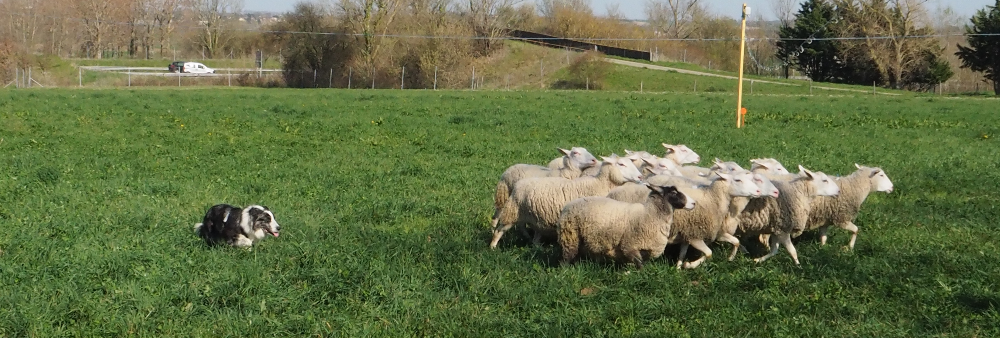

# Collective responses of flocking sheep (*Ovis aries*) to a herding dog (border collie)

This repository contains the code for the manuscript:
Collective responses of flocking sheep to a herding dog. Jadhav, V., Pasqua, R., Zano, C., Roy, M., Tredan G., Bon, R., Guttal, V., Theraulaz, G. (2024). The codes are tested to run on MATLAB Version: 23.2.0.2485118 (R2023b).

# Raw data

The code is divided into three parts:
- The directory `/main_text` contains codes to reproduce figures in the main text.
- The directory `/sm` contains codes to reproduce figures in the Supplementary text.
- The directory `/model` contains codes simulate commputational model introduced in the main text.

The raw sheep trajectory data is in .dat file. Before running MATLAB codes to reproduce any figure of the main text, please run `/main_text/pre_ana.m` and `/main_text/pre_ini_ana.m` respectively. 

